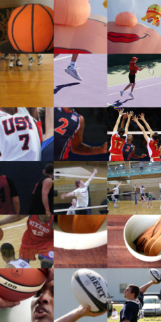

# concept-based-explanations-and-class-contrasting

contains the code to reproduce the results for the imagenet models; Link to arxiv version of the paper is following shortly

Example of using our method to explain why a ResNet50 model from pytorch model zoo predicts the class basketball. We extract the six main prototypes for the class basketball (shown in the left column). The middle column shows the same prototypes, but we only sample them from images where the model does not predict basketball (crucially to note, is that for the combined middle column image the model predicts basketball again). The last column shows the original images that the middle column images were cropped out of. They were predicted as ballon, racket, volleyball, volleyball, wooden spoon, rugby ball; But for the model, the combined image from crops of them is predicted as basketball. This works not only for basketball, but for 710 out of the 1000 of the classes.

--------------------------------------

example_notebook_component_pred_layer4.ipynb produces the first image with the basketball example shown in the paper.
It creates the explanation using layer4.2 and also checks the model's prediction for that explanation

example_notebook_component_pred.ipynb does the same but using layer3.5

Both require the ImageNet1K validation data to run.

First we would need to run example_generate_predictions_list_imagenet.py
This generates and saves the predictions for each of the three imagenet models for each of the validation sample. We need that, since when we
wish to explain some class 'A', then in the generation process of the NMF basis we only include images where the model predicts that class 'A'

example_nmf_decomp_imagenet.py does the NMF decomposition for all 1000 imagenet classes, and saves the NMF basis (one per class).
These are used in the two notebooks (in order to be able to run the notebooks without generating all the NMF decompositions, we included all the 1000 NMF basis for
the ResNet50 model for layer3.5. For layer4.2 we included class 350 to 550 and fireboat (we could not include all due to the file size)). Those are inside the data_for_example folder. This method is shown in Figure 2.
Takes roughly a day on a single GPU per model and layer

example_pred_from_component.py then runs the prediction test (results shown in the paper in table 1 and 2), the results are saved and can be printed using print_results/print_nmf_comp_pred.py
That is a bit faster, takes a couple of hours on a single GPU per model and layer

example_generate_basis_visualization_from_data_imagenet.py generates the visualizations for each of the NMF basis that was previously computed and saves
them as .jpg to the same location

-------------------

For contrasting

For contrasting, we first need to generate the hyperplanes (shown in Figure 3 in the paper), for that we need to run example_contrast_diagnoses_data_gen_imagenet.py.
That will first run generate_data (corresponding to step 1-3 in Figure 3) and then train_linear_classifier which corresponds to step 4 in Figure 3.

After that is completed, we can run the shifting test (the results from those are shown in Table 3)
example_sanity_check_imagenet.py runs that shifting test and saves the results.
Those results can be printed using print_results/print_sanity_check_results.py

-----------------

For the Alaskan Malamute vs Siberian Husky test reported in Table 4, that can be reproduced by running test_husky_add_person_malamute.py
and it also saves the two images shown in Figure 9 (husky_images_person_inserted.jpg and husky_images_black_inserted.jpg)

-----------------

decoder contains code that was used in the supplementary material to generate the visualizations via gradient descent in a latent space of a GAN for Figure 10-12 for the digipath examples (that GAN code is in decoder, the model weights themselves are not included)

